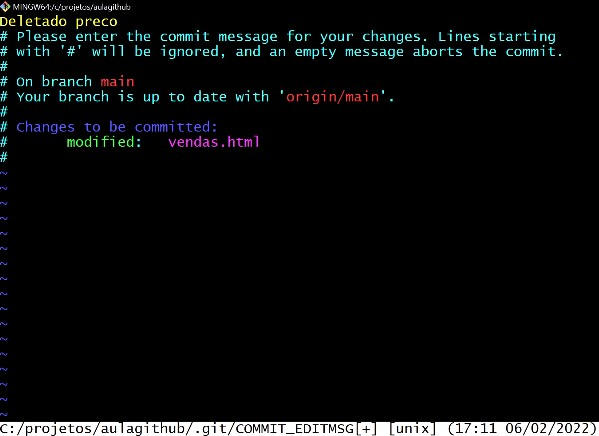

# *Básicos*
## Inicializando repositorio
```
git init
git add .
git commit -m "Mensagem explicativa"
git branch -M main
git remote add origin 
git push -u origin main
```

**git init** = inicia o repositorio na pasta.

**git add .** = adiciona todos os arquivos para staged

**git commit -m "Mensagem"** = Faz o commit

**git branch -M main**  = Garante que a branch usada vai ser main

**git remote add origin <repositorio>** = Vincula ao repositorio do Github

**git push -u origin main** = Sobe as mudanças registrando o repositorio

## Clonando repositorio
```
git clone <repositorio>
git add .
git commit -m "Mensagem explicativa"
git push
```
**git clone <repostorio>** = Traz o repositorio remoto para a maquina

## Atualizar repositorio atual com alterações do remoto
```
git pull <nome do remote> <nome da branch>
```

Exemplo: `git pull origin main`

# *Médios*
## Verificar a remote
```
git remote -v
```

## Traz o status dos arquivos no commit
```
git status
```

## Listagem mudanças em arquivo
```
git diff arquivo
```

## Log com historico dos commits
```
git log
``` 
Lista resumida:
```
git log --oneline
```

## Alternar para outro commit ou branch
```
git checkout <cod.commit\branch>
```
Também é possivel ir para commits anteriores usando `HEAD~quantidade`, exemplo : HEAD~1 pra ir no penultimo commit.

# *Avançados*
## Apontar projeto para outro repositorio remoto (Copiar local e os historicos para outro remoto)
```
git remote -v
git remote set-url origin <repositorio>
git push -u origin main
```

## Desfazer modificações que não salvaram (staged sem commitar) 
```
git status
git reset
git clean -df
git checkout -- .
```
**git reset** = Tira as mudanças do staged 

**git clean -df** = Remove arquivos Untracked

**git checkout -- .** = Apaga/desfaz as alterações Modified

## O editor VIM abriu do nada


Pra ativar o modo de edição:
```
i
```

Sair do VIM, salvando alterações:
```
<ESC>
:wq
<Enter>
```

Sair do VIM, sem salvar alterações:
```
<ESC>
:q!
<Enter>
```

## Desfazer o ultimo commit sem mudar os arquivos
```
git reset --soft HEAD~1
```

## Deletar commit e as alterações (Retornar para cenario anterior)
```
git reset --hard <código do commit>
```

Voltar o projeto ao estado do penúltimo commit:
```
git reset --hard HEAD~1
```
`Atenção!!!!!!
Só faz isso se tiver certeza da decisão`

### Se mudou de ideia e as alterações ainda estiverem salvas no origin. Usa o `git pull` para desfazer