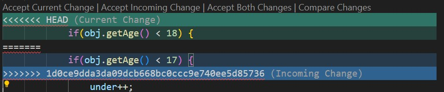

# Conflito simples:
### Push rejeitado (Local ficou atrasado em relação a remoto)

1. Primeiro vai precisar atualizar a local usando o `git pull`;
2. Nesse momento vai abrir o VIM, porque o arquivo novo do historico remoto está no "meio do caminho" das alterações da local;
3. `Sair do VIM salvando a mensagem` sugerida para o commit de merge;

4. Agora, finalmente poderá seguir com o `git push`, sem problemas.

# Conflitos trabalhosos
## Historicos distintos sobre um mesmo arquivo (3 vias)
1. Atualiza a local;
2. Faça a analise sobre o contexto do conflito e qual trecho deve ser mantido. Exemplo:

3. Agora é só seguir normalmente com o `push`.

## Forçar o historico local para sobrescrever o historico remoto
1. Use o `git reset --hard <código do commit>` para definir o ponto de historico que vai manter
2. Depois `git push -f` para forçar o historico a sobrescrever o remoto